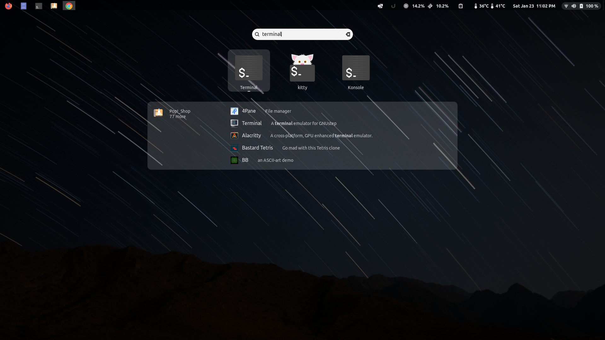
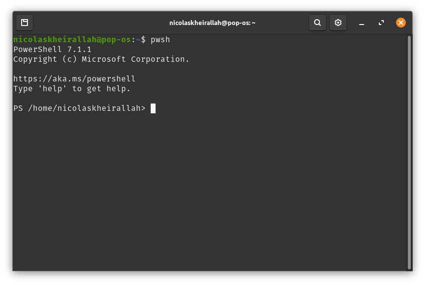
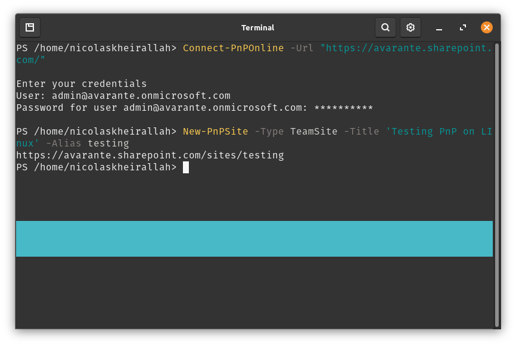
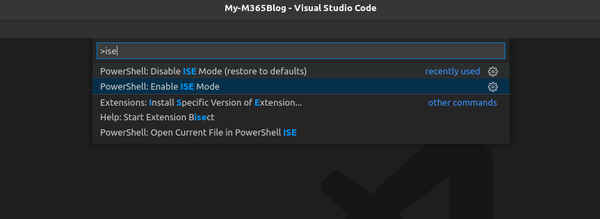
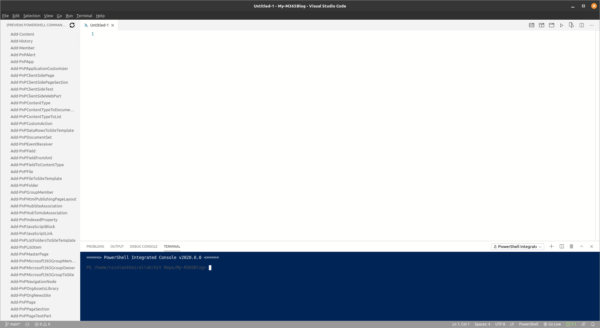

Last post  we went through how to install Powershell and PnP on linux, in this post we are going make it easier to use :) 

So how to we start using Powershell ? Well for short commands you can always start terminal:

after that we type pwsh and powershell will start:

Now your regular PnP commands will work as usual :) I've tested on SharePoint online and creating a team works perfectly:

But what if you want to create a script? Well ISE doesn't exist for linux or it kinda does with help from Visual studio code: 

By pressing Ctrl + P we can enable ISE mode. So what is ISE mode ? exactly how it sounds :)  It converts your VS Code to Powershell ISE:

